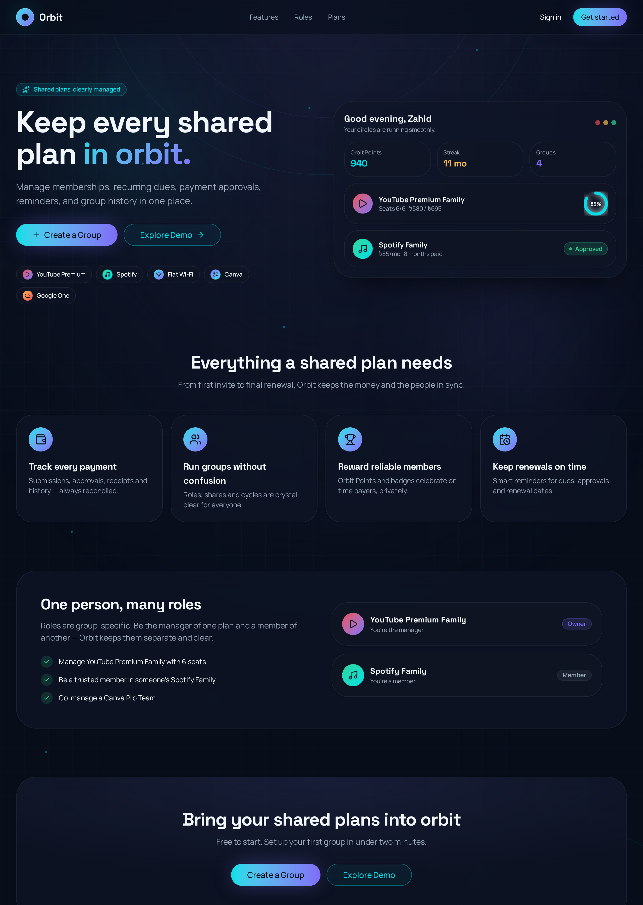
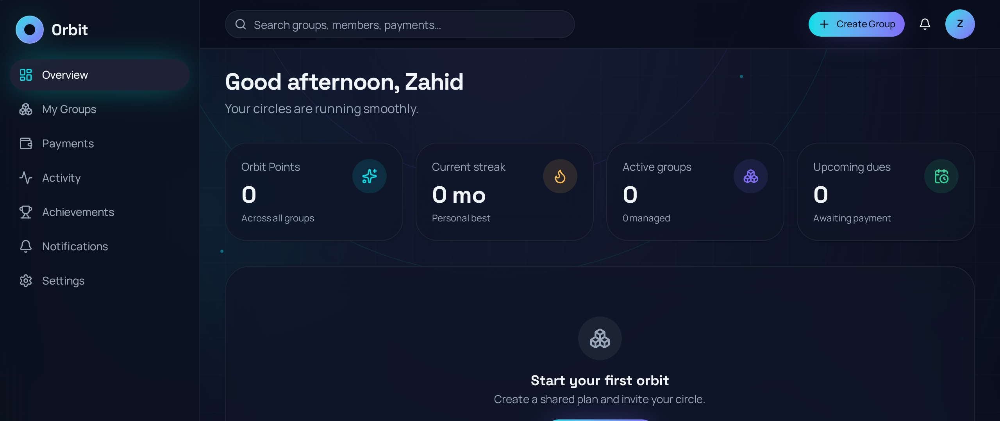

# Orbit Share

**Keep every shared plan in orbit.** Orbit Share is a full-stack app for managing shared subscriptions and recurring group expenses for trusted circles: family plans, flatmate bills, team tools, and more. It handles memberships, monthly dues, payment submissions and approvals, reminders, and a friendly non-financial reputation system called **Orbit Points**.



---

## Highlights

- **Shared subscription management** for families, flatmates, teams, and trusted groups.
- **Groups and roles** for owners, co-managers, and members, with roles scoped per group.
- **Payment lifecycle** with submissions, approvals, rejections, review notes, and history.
- **Approval queue** with filters, sorting, search, and bulk review actions for managers.
- **Notifications and activity** for payment outcomes and group audit history.
- **Orbit Points** for private reliability streaks and achievements.

## Screenshots

### Landing page


### Dashboard



## Tech stack

| Layer         | Technology                                                   |
| ------------- | ------------------------------------------------------------ |
| Framework     | [TanStack Start](https://tanstack.com/start) (React 19, SSR) |
| Build tool    | Vite + Nitro                                                 |
| Styling       | Tailwind CSS v4 + custom `oklch` design tokens               |
| UI components | shadcn/ui + Radix primitives, lucide-react icons             |
| Data & auth   | Supabase — Postgres, Auth, RLS                               |
| Server logic  | TanStack `createServerFn`                                    |
| Data fetching | TanStack Query                                               |

## Key features in depth

### Groups

- 5-step creation wizard for setting up a shared plan (name, category, cost, seats, split method, payment handles).
- Invite codes with a public preview page and one-click join.
- Group detail page with members, payments, and activity tabs.

### Payments

- Members submit a payment for the current cycle with method, transaction ID, and note.
- **Fix & resubmit** flow pre-fills prior details from a rejected submission and confirms before creating a new attempt.
- Timeline with status filters (pending / approved / rejected), text search, date-range presets, and sort order — all persisted per group.

### Manager tools

- Global approval queue with single and bulk approve/reject.
- Rejection reasons surface directly on the member's payment screen and history.
- Member role management and removal for owners and co-managers.

### Reputation

- Orbit Points and streaks reward reliable members without exposing financial rankings.
- Achievements and a per-user Orbit profile card.

## Data model

Core tables (all secured with Row-Level Security):

- `profiles` — user-facing profile and payment handles.
- `groups` — shared plans, costs, seats, invite codes.
- `group_members` — membership, roles, shares, points, and streaks.
- `payments` — submissions with status and manager review notes.
- `notifications` — in-app alerts.
- `activity` — audit/activity feed entries.

## Getting started

Create a local `.env` file from `.env.example`, then fill in your Supabase project values.

```bash
npm install
npm run dev
```

The app runs at `http://localhost:8080`.

### Scripts

| Command           | Description                      |
| ----------------- | -------------------------------- |
| `npm run dev`     | Start the dev server             |
| `npm run build`   | Production build                 |
| `npm run start`   | Run the production server output |
| `npm run preview` | Preview the app locally          |
| `npm run lint`    | Run ESLint                       |
| `npm run format`  | Format with Prettier             |

## Deployment

The project is ready for Vercel with `vercel.json`, Nitro, and the standard `npm ci` plus `npm run build` flow. Add these environment variables in Vercel before deploying:

- `SUPABASE_URL`
- `SUPABASE_PUBLISHABLE_KEY`
- `SITE_URL`
- `VITE_SUPABASE_URL`
- `VITE_SUPABASE_PUBLISHABLE_KEY`
- `VITE_SITE_URL`
- `SUPABASE_SERVICE_ROLE_KEY` if you use server-side admin operations

Do not create any `VITE_` service role variable. Anything with a `VITE_` prefix can be exposed to the browser bundle.

## Database Setup

Run the single setup script in `supabase/database.sql` against a fresh Supabase/Postgres database. It contains the complete schema, RLS policies, helper functions, grants, invite-code flow, notifications table, and later migration changes in the correct order.

## Project structure

```
src/
├── routes/            # File-based routes (landing, auth, /app/*, group detail)
├── components/orbit/   # Orbit-specific UI (cards, avatars, rings, sidebar)
├── components/ui/      # shadcn/ui primitives
├── hooks/              # useAuth and helpers
├── lib/                # orbit-api data layer, demo data, formatting
└── integrations/       # Supabase clients and auth middleware
```

## License

Private project. All rights reserved.
